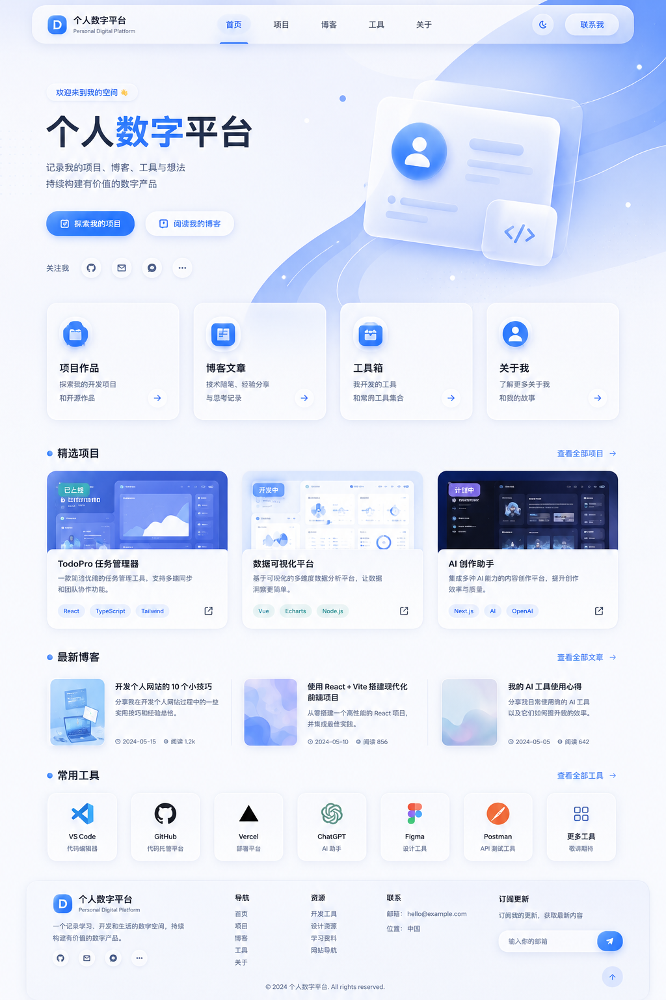

# 个人数字平台主需求书 PRD

> 项目名称：个人数字平台  
> 项目类型：个人主页 / 作品集 / 博客 / 工具入口 / 项目聚合主站  
> 第一版目标：完成一个可上线、可扩展、视觉高级的静态个人主站。  
> 当前确认风格：蓝白极简拟态风 + 玻璃质感 + 纵向主滚动 + 局部横向切换。

---

## 1. 项目背景

本项目用于替代原先单纯“工具集合网站”的方案。新的方向不是普通导航站，而是一个长期维护的个人主站，用于集中展示个人信息、博客文章、项目作品、自研工具、常用工具入口以及后续新增的数字产品。

本网站需要承担“个人数字入口”的作用：以后新增网站、网页工具、小程序、博客、实验项目，都可以挂载到这个主站中，通过项目介绍页或跳转入口对外展示。

---

## 2. 项目核心定位

本项目定位为“个人数字平台”。它不是复杂业务系统，不是多用户产品，也不是后台管理系统，而是一个具有展示性、聚合性、扩展性的个人主页平台。

核心定位：

- 个人主页：展示个人简介、方向、当前状态。
- 作品集：展示个人开发项目、网站、小程序、工具和实验作品。
- 博客记录：记录开发过程、学习笔记、项目复盘和想法。
- 工具入口：收纳自研工具和常用外部工具。
- 项目生态入口：未来所有新项目都可以从这里进入。

第一版重点不是功能复杂，而是：

- 页面好看。
- 风格统一。
- 信息清晰。
- 动效自然。
- 后续容易新增内容。
- 文档和开发进度可追踪。

---

## 3. 视觉参考图

以下图片为已确认的首页视觉方向，开发时应以该图的整体气质、配色、卡片风格、留白、圆角、蓝白渐变、轻拟态效果作为主要参考。



开发要求：

- 不要求 1:1 复刻图片中的每个具体项目名称和图标。
- 需要保留图片中的整体风格：蓝白渐变、极简拟态、玻璃卡片、柔和阴影、高留白、干净科技感。
- 页面整体不能做成普通静态导航站，也不能做成杂乱工具集合页。
- 首页需要有个人数字平台的主站感和作品集展示感。

---

## 4. 设计风格要求

### 4.1 整体风格

整体视觉采用“蓝白极简拟态风”。页面应呈现干净、轻盈、科技、柔和、高级的个人数字空间感。

关键词：

- 蓝白渐变。
- 极简风。
- 轻拟态。
- 玻璃拟态。
- 柔和阴影。
- 大圆角。
- 半透明卡片。
- 高留白。
- 轻科技感。
- 克制动效。

### 4.2 色彩方向

建议基础色：

- 页面背景：浅蓝白渐变，例如 `#F7FBFF`、`#EEF6FF`、`#FFFFFF`。
- 主强调色：明亮蓝，例如 `#2F7BFF`、`#4A90FF`。
- 辅助蓝：浅蓝、雾蓝、冰蓝。
- 主文字：深蓝黑，例如 `#172033`。
- 次级文字：灰蓝，例如 `#64748B`。
- 卡片背景：白色 / 半透明白。
- 边框：浅蓝灰半透明。

### 4.3 卡片风格

卡片需要具有轻拟态和玻璃质感：

- 圆角建议 20px - 32px。
- 背景可使用 `rgba(255, 255, 255, 0.72)`。
- 搭配 `backdrop-filter: blur(...)`。
- 使用柔和阴影，不使用厚重黑色阴影。
- 悬停时轻微上浮、边框高亮、阴影增强。
- 项目卡片需要有封面区域、标题、简介、标签、状态、入口按钮。

### 4.4 字体与排版

- 中文优先使用系统无衬线字体：`PingFang SC`、`Microsoft YaHei`、`Noto Sans SC`、`system-ui`。
- 标题字号要明显，首页主标题需要有视觉冲击。
- 段落文字保持简洁，不要密集堆叠。
- 模块间距要宽松，避免拥挤。

---

## 5. 交互与动效方案

本项目采用“纵向主滚动 + 局部切换式展示”的混合交互方案。

### 5.1 总体交互原则

- 整体浏览方式以上下滚动为主。
- 首页主要模块可以接近整屏高度，形成分屏展示感。
- 不采用全站纯左右切屏，避免像 PPT 或影响后续扩展。
- 项目、博客精选、工具等局部模块可以采用横向滑动、轮播、卡片切换。
- 动画要高级、轻盈、克制，不能花哨。

### 5.2 首页滚动效果

首页建议由多个展示区块组成：

1. Hero 首屏。
2. 项目作品展示屏。
3. 博客精选屏。
4. 工具入口屏。
5. 关于与联系收尾屏。

每个区块在滚动进入视口时，应有淡入、上移、缩放或视差类动效。可以使用滚动吸附效果，但必须保证浏览自然，不得造成操作卡顿或不便。

### 5.3 局部横向切换

以下模块需要重点体现横向切换体验：

- 精选项目模块：横向卡片滑动，当前卡片突出，左右可切换。
- 最新博客模块：可横向展示 3-4 篇文章，移动端支持手势滑动。
- 工具入口模块：可按分类切换，也可横向滑动工具卡片。

### 5.4 卡片交互

- 卡片悬停：轻微上浮、阴影增强、边框高亮。
- 按钮悬停：蓝色渐变增强、轻微缩放或光晕。
- 图标悬停：轻微旋转、上浮或背景亮起。
- 卡片进入视口：依次淡入，避免所有元素同时出现。

### 5.5 推荐动效技术

如果使用 React 技术栈，推荐使用：

- Framer Motion：滚动入场、卡片切换、页面过渡。
- CSS transition / animation：按钮、卡片、背景流动等轻量动效。
- CSS scroll-snap：仅用于首页部分展示区块，不能影响普通页面阅读。

---

## 6. 页面结构

第一版需要完成以下页面：

```text
/
首页

/projects
项目作品页

/projects/:id
项目详情页

/blog
博客列表页

/blog/:id
博客详情页

/tools
工具入口页

/about
关于我页面
```

### 6.1 首页

首页是主站核心入口，需要体现“个人数字平台”的整体气质。

首页建议结构：

1. 顶部导航栏。
2. Hero 个人数字平台首屏。
3. 四个核心入口卡片：项目、博客、工具、关于。
4. 精选项目横向展示。
5. 最新博客展示。
6. 常用工具入口。
7. 关于与联系收尾区域。
8. Footer。

首页 Hero 文案示例：

```text
个人数字平台
记录我的项目、博客、工具与想法，持续构建有价值的数字产品。
```

主按钮建议：

- 探索我的项目。
- 阅读我的博客。

### 6.2 项目作品页

项目页用于展示个人开发项目、网站、小程序、网页工具和实验项目。

必须支持：

- 项目列表。
- 项目分类筛选。
- 项目状态展示。
- 项目技术标签。
- 项目卡片动效。
- 项目详情页跳转。

项目状态包括：

- 开发中。
- 已上线。
- 计划中。
- 维护中。
- 已暂停。

项目类型包括：

- 个人网站。
- 网页工具。
- 微信小程序。
- AI 应用。
- 自动化工具。
- 实验项目。

### 6.3 项目详情页

项目详情页用于说明单个项目的背景和价值。

内容建议：

- 项目名称。
- 项目简介。
- 项目背景。
- 核心功能。
- 技术栈。
- 页面截图或预览图。
- 项目状态。
- 访问链接。
- GitHub 链接，可选。
- 后续计划。

### 6.4 博客列表页

博客页用于展示开发记录、项目复盘、教程笔记、学习记录和个人想法。

必须支持：

- 文章列表。
- 分类筛选。
- 标签展示。
- 搜索文章标题或摘要。
- 博客详情页跳转。

博客分类建议：

- 开发记录。
- 项目复盘。
- AI 工具。
- 学习笔记。
- 网站搭建。
- 生活想法。

### 6.5 博客详情页

博客详情页用于展示文章正文。

内容包括：

- 标题。
- 发布时间。
- 分类。
- 标签。
- 正文。
- 返回博客列表。
- 上一篇 / 下一篇，可选。

第一版可以使用本地 Markdown 或数据文件管理文章内容，不需要后台发布系统。

### 6.6 工具入口页

工具页用于展示自研工具和常用外部工具。

工具必须区分：

- 自研工具。
- 常用工具。

工具分类建议：

- 自研工具。
- AI 工具。
- 开发工具。
- 效率工具。
- 设计工具。
- 资源网站。

工具卡片字段：

- 工具名称。
- 一句话说明。
- 分类。
- 是否自研。
- 图标。
- 访问链接。

### 6.7 关于我页面

关于页面用于展示个人简介和网站说明。

内容建议：

- 简短个人介绍。
- 当前关注方向。
- 正在构建的项目类型。
- 技术兴趣。
- 联系方式。
- 网站说明。

---

## 7. 数据结构要求

第一版不需要数据库，使用本地数据文件管理内容，方便后续迁移。

建议目录：

```text
src/data/site.ts
src/data/projects.ts
src/data/posts.ts
src/data/tools.ts
src/data/categories.ts
```

### 7.1 项目数据结构

```ts
export interface ProjectItem {
  id: string;
  title: string;
  description: string;
  type: '个人网站' | '网页工具' | '微信小程序' | 'AI 应用' | '自动化工具' | '实验项目';
  status: '开发中' | '已上线' | '计划中' | '维护中' | '已暂停';
  tags: string[];
  techStack: string[];
  cover?: string;
  demoUrl?: string;
  githubUrl?: string;
  detail: string;
  futurePlan?: string[];
}
```

### 7.2 博客数据结构

```ts
export interface BlogPost {
  id: string;
  title: string;
  summary: string;
  category: string;
  tags: string[];
  date: string;
  cover?: string;
  content: string;
}
```

### 7.3 工具数据结构

```ts
export interface ToolItem {
  id: string;
  name: string;
  description: string;
  category: string;
  url: string;
  icon?: string;
  isSelfBuilt: boolean;
}
```

---

## 8. 推荐技术栈

建议采用：

- React。
- Vite。
- TypeScript。
- Framer Motion。
- CSS Modules 或普通 CSS。
- 本地 TypeScript 数据文件。

第一版不引入：

- 后端服务。
- 数据库。
- 登录系统。
- 评论系统。
- 复杂权限。

### 8.1 推荐目录结构

```text
personal-digital-platform/
├─ docs/
│  ├─ PRD.md
│  ├─ TASKS.md
│  ├─ CHANGELOG.md
│  ├─ ACCEPTANCE.md
│  └─ assets/
│     └─ homepage-concept.png
├─ public/
│  └─ images/
├─ src/
│  ├─ assets/
│  ├─ components/
│  │  ├─ layout/
│  │  ├─ cards/
│  │  ├─ sections/
│  │  └─ ui/
│  ├─ data/
│  ├─ pages/
│  ├─ styles/
│  ├─ App.tsx
│  └─ main.tsx
├─ package.json
└─ README.md
```

---

## 9. 响应式要求

网站必须适配：

- 桌面端。
- 平板端。
- 手机端。

要求：

- 手机端导航可折叠或简化。
- 横向滑动模块在手机端需要支持触摸滑动。
- 卡片在桌面端可多列展示，在手机端单列或横滑展示。
- 首屏标题在手机端不能溢出。
- 动画在低性能设备上不得明显卡顿。

---

## 10. 第一版开发范围

第一版必须完成：

- 首页。
- 项目作品页。
- 项目详情页。
- 博客列表页。
- 博客详情页。
- 工具入口页。
- 关于我页面。
- 蓝白极简拟态视觉风格。
- 滚动入场动画。
- 局部横向卡片滑动。
- 响应式布局。
- 本地数据管理。
- 文档更新机制。

---

## 11. 明确不做的内容

第一版明确不做以下内容，编程平台不得擅自添加：

- 用户登录。
- 注册系统。
- 评论系统。
- 会员系统。
- 后台管理。
- 数据库。
- 多用户权限。
- 投稿功能。
- 在线文章编辑器。
- 支付功能。
- 社交动态功能。

---

## 12. 开发执行规范

编程平台必须遵守以下规则：

1. 必须优先阅读 `docs/PRD.md`。
2. 不允许重新规划项目方向。
3. 不允许擅自增加 PRD 未声明的复杂功能。
4. 每完成一个功能，必须更新 `docs/TASKS.md`。
5. 每次修改必须更新 `docs/CHANGELOG.md`。
6. 阶段完成后必须根据 `docs/ACCEPTANCE.md` 自检。
7. 如果发现需求冲突，应先在文档中标记，不要直接重构。
8. 任何新增页面、组件、数据结构，都要保持蓝白极简拟态风格统一。
9. 代码应保持组件化，避免所有逻辑堆在单个文件中。
10. 动效要服务体验，不允许为了炫技造成卡顿或干扰阅读。

---

## 13. 验收标准概述

第一版完成后，应满足：

- 页面整体风格与视觉参考图一致。
- 首页不是普通长列表，而是具有分屏展示感和模块切换感。
- 项目模块具备横向卡片滑动或轮播效果。
- 博客、项目、工具、关于页面完整可访问。
- 页面在手机和桌面端均正常展示。
- 文档记录完整，任务清单已更新。
- 没有明显布局错位、文字溢出、跳转失效。

---

## 14. 后续扩展方向

后续可考虑：

- 增加实验室页面 Lab。
- 增加网站更新日志页面。
- 增加更多项目详情模板。
- 增加 Markdown 文章管理。
- 后期接入轻量 CMS。
- 后期增加后台管理，但不属于第一版范围。

---

## 15. 第一阶段线上补丁目标

线上复测后，第一版本地基础功能已通过，但正式预览环境暴露出部署路由、SEO 基础文件、占位内容、横向滑动体验和卡片视觉比例等问题。第一阶段线上补丁只处理已上线版本的阻塞问题和体验问题，不引入 Supabase，不拆分子站，不扩大业务范围。

第一阶段线上补丁目标包括：

- 修复 Vercel 深层路由 404。当前 `/projects/nexfolio`、`/blog/testing-from-day-one` 等详情页直接访问或刷新会返回 Vercel 404，原因是 React Router 前端路由缺少 Vercel rewrite 配置。
- 新增 `vercel.json`，将所有路径 rewrite 到 `/index.html`：

```json
{
  "rewrites": [
    {
      "source": "/(.*)",
      "destination": "/index.html"
    }
  ]
}
```

- 复验 `/`、`/projects`、`/projects/nexfolio`、`/blog`、`/blog/testing-from-day-one`、`/tools`、`/about` 直接访问和刷新均不 404。
- 补齐 SEO 基础文件：`public/favicon.svg` 或 `public/favicon.ico`、`public/robots.txt`、`public/sitemap.xml`。
- 补充 `index.html` 基础 Open Graph / Twitter Card meta。
- 清理占位内容：`hello@nexfolio.dev`、`https://github.com/`、`https://example.com` 等无意义占位链接不得出现在正式预览版。
- 没有真实链接的项目按钮应隐藏、禁用或显示“暂未上线”，不得跳转到假地址。
- 示例项目可以保留，但必须标注为示例或替换为真实内容。
- 优化横向滚轮交互：鼠标位于横向模块内部时，纵向滚轮映射为横向滚动；鼠标位于模块外部时，页面保持正常纵向滚动；横向滚动到最左或最右边界后，继续滚动时允许页面恢复纵向滚动，避免用户被卡住；移动端继续保留触摸横向滑动。
- 横向滑动容器实现时应只在容器可横向滚动且鼠标位于容器内时接管滚轮，将 `deltaY` 映射到 `scrollLeft`，在横向滚动未到边界时 `preventDefault`，到达边界后允许页面纵向滚动。
- 横向模块需要增加左右切换按钮、轻量进度条、当前卡片强调、边缘渐隐提示等明确操作提示。保持蓝白极简拟态风，不引入重型轮播插件，不做花哨复杂轮播。
- 调整卡片比例与封面层级，解决椭圆封面嵌套灰色方块等不协调视觉。
- 复查移动端导航，在 390px、430px、768px 下检查顶部导航高度；如果导航占用过高，改为 Logo + 菜单按钮，并点击展开玻璃拟态菜单 / 抽屉导航。
- 提升正式作品集质感：补充真实项目封面图或更精致的抽象封面、统一图标系统、更好的 Hero 视觉区域、社交入口、更精致 Footer、项目截图展示能力。
- 重新执行 `npm run lint`、`npm run test`、`npm run build`、`npm run test:ui`。
- 重新部署 Vercel 并进行线上复验。

## 16. 交互与卡片视觉补充规范

### 16.1 横向模块滚轮交互规则

- 横向模块必须支持鼠标滚轮辅助横向滚动。
- 鼠标位于横向滑动模块内部时，滚轮上下滚动应转换为横向滚动。
- 鼠标位于横向滑动模块外部时，页面继续正常上下滚动。
- 横向模块滚动到最左或最右边界后，再继续滚动时应允许页面恢复正常纵向滚动。
- 移动端仍保留触摸横向滑动，不因桌面滚轮逻辑影响手势操作。
- 横向模块需要有左右按钮、进度提示或边缘渐隐提示，帮助用户理解可横向浏览。

### 16.2 卡片封面与内容比例规范

- 禁止出现椭圆封面嵌套灰色方块这类不协调视觉。
- 外层卡片保持玻璃白底、大圆角、柔和蓝色边框和阴影。
- 内层封面建议使用 16:9 或 4:3 的浅蓝渐变面板。
- 内层封面圆角要小于外层卡片。
- 封面内部可以放项目类型、图标、简洁抽象线条或真实截图占位。
- 第一版可以使用抽象封面，但不能像未完成占位块。
- 项目、博客、工具卡片的封面、内容、标签、入口按钮层级要统一。
- 卡片内容区保持标题、摘要、标签、入口链接的清晰层级。
- 项目卡片后续应支持真实截图展示。
- 目标是更接近高级个人作品集，不要像普通模板卡片或奇怪嵌套块。

## 17. 第二阶段：Supabase 轻量真实后台版

第二阶段目标是把本地静态数据逐步迁移到 Supabase，支持站主登录、内容管理、草稿、发布、前台自动读取。第二阶段只做单站主后台，不做多用户社区，不开放注册，不做评论系统，不做投稿系统，不做支付系统，不做社交动态。

第二阶段需要包含：

- Supabase Auth 站主登录。
- `posts` 表：博客文章。
- `projects` 表：项目作品。
- `tools` 表：工具入口。
- `categories` / `tags` 可选。
- `draft` / `published` / `archived` 状态。
- `created_at` / `updated_at` / `published_at`。
- `slug` 字段。
- `seo_title` / `seo_description` 字段。
- `is_featured` / `is_recommended` 字段。
- `sort_order` 字段。
- 前台只读取 `published` 内容。
- 管理端路径建议使用 `/studio`。

第二阶段页面建议：

- `/studio/login`
- `/studio/dashboard`
- `/studio/posts`
- `/studio/posts/new`
- `/studio/posts/:id/edit`
- `/studio/projects`
- `/studio/projects/new`
- `/studio/projects/:id/edit`
- `/studio/tools`
- `/studio/tools/new`
- `/studio/tools/:id/edit`

第二阶段安全要求：

- Supabase URL 和 anon key 使用环境变量。
- 不允许在前端暴露 service_role key。
- 开启 RLS。
- 只有指定站主账号可以写入、更新、删除。
- 普通访客只能读取 `published` 内容。
- `draft` 草稿不能出现在前台。

## 18. 长期架构预留：总站 + 子站拆分

当前个人数字平台第一阶段采用单站点结构，博客、项目、工具均在主站路径下展示。后续当内容规模增长后，允许将博客、项目库、工具库逐步拆分为独立子站。

可能的长期结构：

- 主站：`nexfolio.com`
- 博客子站：`blog.nexfolio.com`
- 项目子站：`projects.nexfolio.com`
- 工具子站：`tools.nexfolio.com`

也可以先使用路径结构：

- `nexfolio.com/blog`
- `nexfolio.com/projects`
- `nexfolio.com/tools`

再逐步迁移到子域名。

拆分原则：

1. 当前阶段不拆分，先保证主站完整。
2. 主站始终作为个人数字总入口。
3. 主站只展示精选博客、精选项目、推荐工具和跳转入口。
4. 子站负责完整内容浏览和深度功能。
5. 博客、项目、工具数据统一存放在 Supabase。
6. 主站和子站读取同一套数据源，避免重复维护。
7. 所有内容必须使用稳定 slug。
8. 数据表中预留 `canonical_url`、`redirect_from` 等字段，方便后期迁移和 SEO。
9. 拆分时保留旧路径跳转，避免历史链接失效。
10. 子站拆分应逐步进行，优先拆内容量最大、功能最复杂的模块，不一次性全部拆。

建议拆分顺序：

1. 工具站：当自研工具和常用工具数量明显增加时优先拆分。
2. 博客站：当文章数量较多、需要更完整阅读体验时拆分。
3. 项目站：当项目作品数量较多、需要案例库体验时拆分。

长期架构预留只写入文档，不在当前阶段开发。

---

## 19. 第二阶段实现补充：Supabase Studio 轻后台

第二阶段实现遵守原规划，只做单站主轻量后台，不引入多用户社区、评论、支付、Storage、Realtime、Edge Function 或独立子站拆分。

已实现范围：

- 前台内容读取层优先读取 Supabase 中 `is_published = true` 的 `posts`、`projects`、`tools`。
- 当 Supabase 未配置、请求失败或数据为空时，前台显示空状态，不再回退到示例内容。
- `/studio/login` 支持 Supabase Auth 邮箱密码登录；未配置 Supabase 时显示清晰提示。
- `/studio` 下页面需要登录访问；未登录访问会跳转到 `/studio/login`。
- Studio 包含概览、博客、项目、工具管理列表，以及新建、编辑、草稿、发布、取消发布、删除能力。
- `tags`、`tech_stack`、`features`、`future_plan` 使用 textarea 输入，并在保存时转换为数组字段。
- `supabase/schema.sql` 提供 `posts`、`projects`、`tools` 建表 SQL、RLS policy 和 `updated_at` 自动更新时间 trigger。
- `.env.example` 与 `docs/SUPABASE_SETUP.md` 提供环境变量、SQL 执行、Vercel 配置和首个站主账号创建说明。

未自动完成范围：

- Supabase 项目创建需要站主手动完成。
- `supabase/schema.sql` 需要站主在 Supabase SQL Editor 中执行。
- 本地 `.env.local` 与 Vercel 环境变量需要站主手动配置。
- 首个站主账号需要站主在 Supabase Auth 中创建。
- 配置真实 Supabase 后，需要再次进行线上 CRUD 与 published-only 前台展示验收。

---

## 20. 第二阶段 UI / 架构重构补充

本轮重构目标是把 NexFolio 从“模板演示站”升级为“真实长期运营的个人数字平台”。主站必须内容驱动、结构清晰、可维护，并与 Tavern / roleplay 系统解耦。

### 20.1 Tavern 结构隔离

- Tavern / roleplay / chat / memory / worldbook / provider / prompt / character / conversation 等相关逻辑迁移到 `packages/tavern/`。
- NexFolio 主站不再 import Tavern 源码，不再在主导航暴露 `/roleplay`。
- Tavern 代码不删除，只隔离，为后续独立部署预留。
- 主站只保留首页、项目、博客、工具、关于页、Studio 后台和 Supabase 内容系统。

### 20.2 前台真实内容策略

- 前台只展示 Supabase 已发布内容，即 `is_published = true`。
- 本地项目、博客、工具数据不得作为公开 fallback。
- Supabase 未配置、请求失败或空表时，页面显示空状态。
- 草稿、未发布、归档内容不得出现在前台。
- 空状态文案：博客“暂无文章”，项目“暂无项目”，工具“暂无工具”，首页模块“暂未发布内容”。

### 20.3 首页结构与视觉

- 首页结构调整为 Hero、About / Current Focus、精选项目、最新博客、工具、Footer。
- Hero 右侧改为“个人介绍 + 当前重点”，不再使用 Now Building、Supabase Ready、Blue Glass UI 等模板化内容。
- Hero 内容强调独立开发者、长期建设、真实内容流和当前重点。
- 保持蓝白极简玻璃风格，但降低 SaaS landing page 感，提升个人主页真实感。
